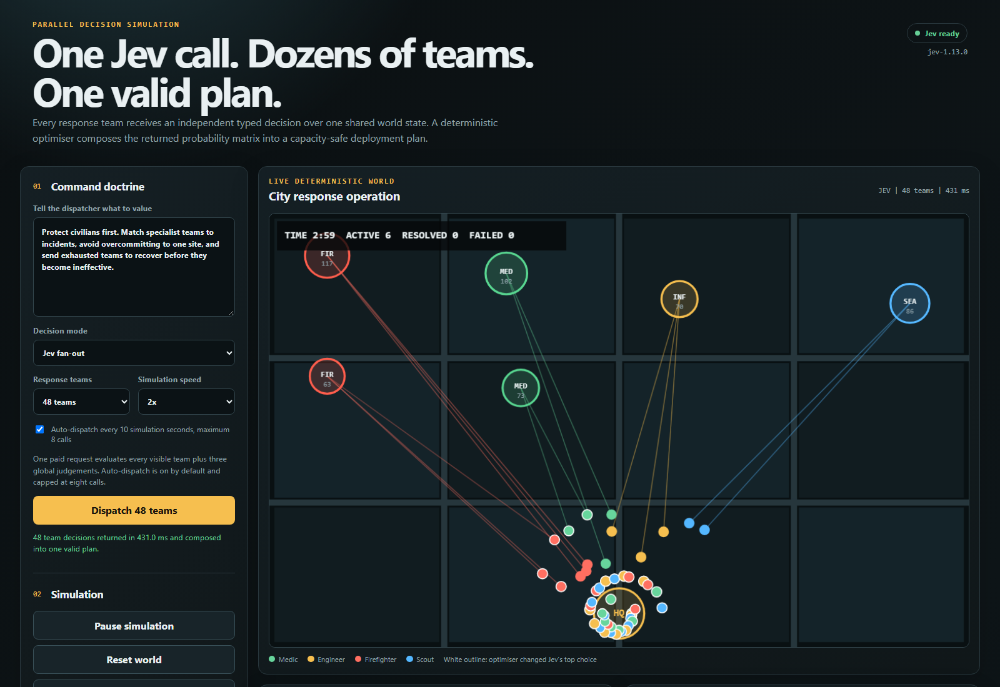

# Jev Parallel Dispatch

[](https://github.com/Jason-Doyle/jev-parallel-dispatch/actions/workflows/ci.yml)
[](https://github.com/Jason-Doyle/jev-parallel-dispatch/actions/workflows/codeql.yml)
[](LICENSE)

[](https://github.com/Jason-Doyle/jev-parallel-dispatch/releases/download/v0.1.0/jev-parallel-dispatch-demo.mp4)

[Watch the 33-second demo recording](https://github.com/Jason-Doyle/jev-parallel-dispatch/releases/download/v0.1.0/jev-parallel-dispatch-demo.mp4).

Jev Parallel Dispatch is a browser simulation for testing high-volume typed decisions
against a shared, changing game state.

Jev evaluates 8 to 48 specialist response teams in one request. Each team receives a
`Choice` over the active incidents, recovery, or holding position. The same request
returns global `Score` and `Noul` judgements for operational risk, coordination
pressure, and when to reassess.

The model does not control the simulation directly. A deterministic optimiser consumes
the returned probability matrix, blends uncertain answers with a local policy, and
enforces each incident's capacity before applying assignments.

## How it works

```text
shared world state
  -> one typed Jev question per response team
  -> probability distributions and confidence values
  -> confidence-aware blending with a local policy
  -> maximum-weight capacity-constrained assignment
  -> deterministic simulation
  -> same-snapshot Jev versus local counterfactual
```

The simulation includes:

- Medic, engineer, firefighter, and scout teams.
- Fire, medical, infrastructure, and search incidents.
- Incident growth, failure thresholds, civilian losses, stamina, and recovery.
- Automatic dispatch with an eight-call safety cap.
- A deterministic local baseline after every Jev wave.
- A 20-second counterfactual branch from the same frozen snapshot.
- Live latency, throughput, token, cost, confidence, and assignment reporting.
- Downloadable world snapshots and decision traces.

Movement and incident resolution run locally and make no model calls. Automatic dispatch
waits without spending tokens when no incidents are active.

## Clone and run

Requirements:

- Node.js 22 or newer.
- A TypeSafe API key for live Jev mode.

```bash
git clone https://github.com/Jason-Doyle/jev-parallel-dispatch.git
cd jev-parallel-dispatch
npm ci
```

Create a local environment file:

```bash
cp .env.example .env
```

PowerShell:

```powershell
Copy-Item .env.example .env
```

Set `TYPESAFE_API_KEY` in `.env`, then start the development servers:

```bash
npm run dev
```

Open <http://localhost:5173>.

Without a key, the application uses the deterministic local dispatcher.

## Production build

```bash
npm run build
npm start
```

Open <http://127.0.0.1:8787>.

The API key remains on the server. It is not sent to the browser or written to the
retained evidence.

## Technical details

The browser owns the deterministic world simulation. It sends a serialisable snapshot
and operator doctrine to the server for each dispatch wave.

The server builds one `Choice` question for every team and three global questions. Jev
evaluates all questions against the same state. The dispatcher then:

1. Reads every task probability for every team.
2. Blends each distribution with a deterministic local utility policy according to Jev
   confidence.
3. Expands incidents into capacity-limited assignment slots.
4. Solves a maximum-weight assignment across all teams and slots.
5. Returns both the model's top choice and the applied assignment.

The server limits all API traffic to 120 requests per minute per client. Dispatch calls
have a separate limit of 20 requests per minute to bound paid model usage.

When Jev mode is active, the browser also evaluates the local policy from the same
snapshot. Both plans are simulated for 20 seconds with identical future incident
arrivals. The comparison ranks outcomes in this order:

1. Fewer civilian losses.
2. Fewer failed incidents.
3. More resolved incidents.
4. Higher score.
5. Lower integrated severity exposure.
6. Higher remaining stamina.

## Validation

```bash
npm run validate
```

This runs Biome, TypeScript, Vitest, and production builds.

The test suite covers deterministic replay, role distribution, capacity enforcement
under adversarial model preferences, identical-snapshot counterfactuals, the HTTP API,
and the official TypeSafe SDK transport.

## Capture the demo

The capture script builds the production application, starts it on a temporary local
port, records a 48-team Jev run in Chromium, and converts the result to MP4.

Requirements:

- `TYPESAFE_API_KEY` in `.env`.
- Chromium installed through Playwright.
- `ffmpeg` available on `PATH`.

```bash
npx playwright install chromium
npm run capture:demo
```

The screenshot is written to `media/jev-parallel-dispatch.png`. The MP4 is ignored by
Git and is intended for a GitHub release asset.

## Retained benchmark evidence

`evidence/fanout-benchmark.json` contains the raw Jev responses, local assignments, and
counterfactual outcomes from ten calls at each scale.

| Teams | Questions | Median latency | Decisions/s | Input tokens | Jev/local/tie branches | Median severity delta |
|---:|---:|---:|---:|---:|---:|---:|
| 8 | 11 | 151.196 ms | 52.913 | 6,683.5 | 3 / 2 / 5 | 0.000 |
| 16 | 19 | 176.671 ms | 90.599 | 12,127.5 | 9 / 1 / 0 | -14.336 |
| 32 | 35 | 263.192 ms | 121.731 | 23,017.5 | 7 / 3 / 0 | -2.406 |
| 48 | 51 | 311.169 ms | 154.259 | 33,887.5 | 5 / 5 / 0 | 0.478 |

All 12 recorded calls had zero capacity violations. Negative severity delta favours
Jev.

Re-run the benchmark with:

```bash
npm run benchmark:fanout -- --units 8,16,32,48 --repetitions 10
```

This command makes paid Jev calls.

## Limits

The simulation is synthetic. Its incident priorities and role-effectiveness table are
implemented assumptions, not emergency-response policy.

Ten scenarios per scale are still not enough to claim that Jev is better than the local
dispatcher. The retained data supports claims about the recorded latency, throughput,
capacity-safe composition, and those counterfactual outcomes only.

## License

MIT
